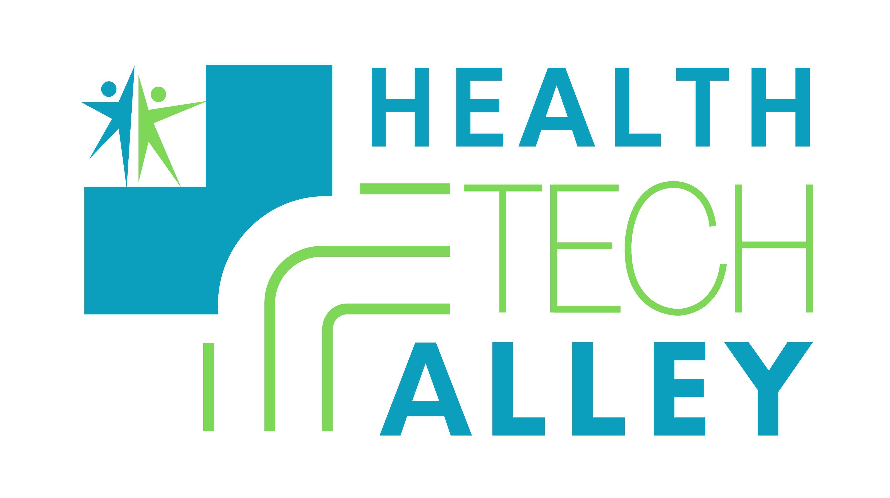

<p align="center">
  
</p>

# Caregiver Concierge: ACCESS-DP

<p>
  
  &nbsp;
  
  &nbsp;
  
</p>

A **Health Tech Alley** project, built with **Expo + React Native**.

<p>
  
  &nbsp;&nbsp;
  
</p>

A mobile health AI application that supports family caregivers of **severely disabled individuals** (disability level 3 on a 1–5 scale) with comorbidities and specialists involved. Built with **Expo SDK 56 and React Native 0.85** for iOS and Android.

The first-run experience is an **onboarding intake** that captures caregiver, patient, provider, and safety details. The profile seeds the on-device SQLite database and drives the dashboard, the SLM system prompt, and the anomaly threshold engine. After onboarding, the user lands on a **tab-based dashboard** (Dashboard, Care, Medications, Schedule, Settings).

**Target conditions:** cerebral palsy, traumatic brain injury (TBI), COPD — plus the three use-case conditions: Spina Bifida, post-stroke rehabilitation, COPD + TBI. *(Diabetes is no longer the primary condition.)*

## App Pillars

The app is organized around three caregiver-facing pillars, each backed by the same on-device AI stack
(SLM + RAG + MCP orchestration) and a deterministic rule/threshold engine that runs offline first.

### 1. Medication Management

The day-to-day heart of the app. Keeps the medication regimen safe, on schedule, and contextually informed.

- **Dosage monitoring** — Per-medication schedule (dose, route, frequency, time-of-day), adherence tracking
  with missed-dose detection, caregiver-acknowledged intake logging, and "what changed?" comparisons
  against the personalized care plan. The Medications tab shows active meds with schedule times and
  "Mark as given" buttons; structured `medication_schedules` table drives reminder notifications.
- **Pharmacy locator and communicator** *(deferred)* — Geofenced pharmacy search, hours/inventory lookups, and a
  consent-gated, tokenized message channel to the patient's preferred pharmacy. The `src/locator/` directory
  is a scaffold awaiting CBO/pharmacy data integration.
- **Drug-interaction awareness** *(deferred)* — On-demand RxNorm / OpenFDA lookups grounded in the patient's active
  medication list; surfaced as **citations**, never as a directive. The `src/clinical-evidence/` directory
  is a scaffold for live API clients (planned: PubMed, MedlinePlus, RxNorm, DailyMed, OpenFDA — see
  `planning/22_clinical-data-gathering.md`).

### 2. Care Management

The longitudinal, patient-specific plan and the signals that watch it.

- **Personal care plan** — A first-run onboarding flow generates a structured care plan
  (demographics, conditions, medications, vitals cadence, emergency thresholds). The profile seeds
  SQLite via `seedDatabaseFromProfile`, and every caregiver action becomes a **trigger event** that
  can refine the plan over time (the "Netflix model" of continuous personalization). The care plan is
  mapped to a **FHIR `CarePlan` resource** (per the HL7 CDA-ccda profile) and includes care-plan goals
  (recovery milestones, target outcomes) in the SLM system prompt.
- **Anomalies** — The deterministic rule/threshold engine and a separate Alert ML model watch vitals
  against the care plan. The Care tab and Dashboard show active alerts with severity-colored cards;
  the `Acute Anomaly` screen exercises the full orchestrator path end-to-end. Anomalies surface with a
  transparency trace; the SLM is invoked **only after caregiver ground-truth** or on an explicit
  "Explain" tap. Emergencies short-circuit the SLM path (Severity 3 fast-path) — the confidence router
  returns preliminary guidance immediately without loading the SLM; "Explain" comes after. After the
  SLM explains, the caregiver sees **multiple-choice next-step options** (Call 911, Go to ER, Contact
  PCP, Find nearby pharmacy, Schedule appointment, Share record, Monitor at home, Add note) wired to
  native deep-links (dialer, maps) or in-app flows.
- **Caregiver Assistant (SLM chat)** — The `slm.tsx` screen streams answers from the on-device SLM
  with the full care plan baked into the system prompt. It falls back to a mock response when no
  model is loaded, and strips structured-output control tokens before display. In **Demo mode** the
  SLM auto-loads on "Ask the assistant" and auto-unloads after 60s idle or on app background.

### 3. Scheduling and Tracking Center

The caregiver's calendar view of the care plan in motion.

- **Appointments** *(UI scaffold)* — Physician + specialist + therapy appointments, tracking, reminders, and a consent-gated,
  encrypted record-share path (FHIR R4). The Schedule tab shows an alert timeline + recent notifications;
  the `providers` table and consent gate are ready for the share path. An appointments table is planned.
- **Tracking** — Adherence history, vitals trends, alert timeline, and audit trail in one place. The
  Schedule tab shows a timeline of recent alerts and notifications; the Care tab shows latest vitals.
- **Dashboard** — Summary card + severity-colored alert cards that subscribe to the event bus. HITL
  confirm / override / escalate controls are present on **every** AI-suggested action. The dashboard
  is the entry point for all three steel threads (ST-01 anomaly, ST-02 trajectory, ST-03 acute).

## Cross-Cutting Features

- **On-device AI** — Clinical decision support runs locally; PHI never leaves the device
- **Human-in-the-loop** — AI proposes; caregiver confirms or overrides every clinical action; nothing clinical auto-executes
- **Offline-first** — Core functionality (reminders, rule engine, dashboards) works with zero connectivity
- **HIPAA-compliant** — Encrypted local storage (SQLCipher + Keychain/Keystore), consent-gated data egress, tamper-evident audit log
- **Transparency trace** — OpenEvidence citations + orchestration trace on every AI suggestion
- **Live RAM dashboard** — The Performance screen polls device memory at 1 Hz and shows
  total / used / free RAM plus a breakdown of how much of the used bucket is owned by
  the on-device SLM model. Color-coded severity (`ok` / `warn` / `crit`, labeled Healthy /
  Elevated / Critical) flags when the device is approaching OOM. The same data is mirrored
  on the SLM and Care Management screens while a model is loaded.
- **Model Manager** — The Models screen lists the GGUF catalog, downloads from Hugging Face
  with live progress, supports a gated-repo access token via `expo-secure-store`, and can
  delete individual models or wipe the on-device `models/` directory. In Demo mode, model
  management is auto-handled; in Developer mode, full manual control is in Settings.
- **MCP orchestration layer** — A single in-process orchestrator receives events from
  the event bus, runs a deterministic CEP engine (with 3-second debouncing for vitals bursts),
  calls four agents (caregiver / patient-state / coordinator / safety-reviewer) through an
  MCP-style tool contract, and decides when to invoke the SLM. A **confidence router**
  returns preliminary guidance for severity-3 alerts without loading the SLM. A
  **prompt-budget guard** truncates the explain prompt to fit the model's context window.
  Per-turn RAM + token attribution is logged to `slm_turns`.
- **Hybrid fused RAG** — One retrieval hop returns both MCP tool schemas (tool-RAG) and
  clinical knowledge chunks (knowledge-RAG). Track A uses a deterministic hash embedder
  over synthetic OpenEvidence / RxNorm / DailyMed / OpenFDA fixtures; Track B will use
  a real sub-1B embedder and live clients. Every clinical answer carries citations.
- **On-device SQLite data layer** — `expo-sqlite` stores health samples, thresholds,
  alerts, caregiver actions, SLM turns, RAG citations, trigger events, audit log, and
  consent tokens. The migration-driven schema is designed so SQLCipher can be swapped in
  later with minimal changes.
- **Audit + consent spine** — Every egress-bearing action must pass a default-deny consent
  gate; all decisions and clinically significant events are written to a tamper-evident
  audit log (`audit_log` + `consent_tokens` tables, `src/services/audit`,
  `src/services/consent`).
- **C-CDA / FHIR record format** — Typed SQLite rows remain the source of truth; a FHIR
  resource layer (`src/data/fhir/`) derives FHIR R4 JSON (Patient, Condition, Observation,
  MedicationStatement, CarePlan per the CDA-ccda profile). C-CDA XML is serialized only on
  consent-gated export/share via `ccdaExportService`. The personal care plan is a FHIR
  `CarePlan` resource with problem/goal/instruction structure.
- **Notifications & reminders** — `expo-notifications` (dynamic require, degrades to in-app
  banner on Track A) fires for three trigger classes: anomaly alerts (severity-3 = DND bypass),
  medication reminders (from structured `medication_schedules`), and appointment/care-task
  reminders. A deterministic reminder engine (no SLM) derives schedules with quiet-hours
  support. Per-trigger toggles in Settings.
- **Anomaly detection next-steps flow** — After the SLM explains an alert, the caregiver
  sees SLM-formulated multiple-choice next-step options from a constrained 8-action taxonomy
  (Call 911, Go to ER, Contact PCP, Find nearby service, Schedule appointment, Share record,
  Monitor at home, Add note). Each is wired to a real action via native deep-links (`tel:`,
  `maps://`/`geo:`) or in-app flows. Severity-3 always injects Call 911 + Go to ER first.
- **Settings & Developer/Demo mode** — A full Settings screen (model management, notification
  preferences, profile editing, consent management, audit log viewer with hash-chain
  verification, data reset/export, theme). **Demo mode** (default, persisted): auto SLM
  management, simplified UI. **Developer mode**: full diagnostics, manual SLM load/unload,
  raw demo screens, audit viewer.
- **Acute anomaly flow** — Simulated vitals feed the orchestrator; threshold violations
  create alerts; severity-3 emergencies short-circuit to the emergency fast path;
  lower-severity alerts can be explained by the SLM on demand, including multiple-choice
  clarifying questions and next-step actions. Alerts can be swipe-dismissed.

## Tech Stack

- **Framework:** Expo SDK 56 + React Native 0.85 + expo-router (file-based routing, tab-based navigation)
- **On-device SLM:** llama.cpp via `llama.rn` — model catalog includes HealthGPT-Pro-4B (Q4_K_M), Gemma-4-E4B (UD-Q2_K_XL), and Gemma-4-E2B (UD-Q2_K_XL); all behind an `InferenceProvider` seam
- **Orchestration:** Model Context Protocol (MCP) — 4 agents (caregiver / patient-state / coordinator / safety-reviewer) mediated by a single `Orchestrator` with CEP debouncing, confidence router, and prompt-budget guard; exposed through `OrchestratorProvider`
- **Retrieval:** Hybrid RAG (`TrackAFusedRetriever`) — BM25 sparse index + deterministic hash dense embeddings + reciprocal rank fusion; fused tool-RAG + knowledge-RAG in a single hop
- **Knowledge base:** OpenEvidence (primary clinical evidence, planned), RxNorm, DailyMed, OpenFDA — Track A uses synthetic fixtures; Track B will use live NLM/NIH API clients (see `planning/22_clinical-data-gathering.md`)
- **Local storage:** `expo-sqlite` with migration-driven schema; SQLCipher-ready design
- **Alert ML:** TensorFlow Lite via `react-native-fast-tflite` with CoreML delegate enabled; autoencoder model + scaler/metadata JSON
- **Wearables:** HealthKit (iOS), Health Connect (Android) — `src/data/sensors` is scaffolded
- **Notifications:** `expo-notifications` (dynamic require) with in-app banner fallback; deterministic reminder engine
- **FHIR/C-CDA:** FHIR R4 resource mappers (`src/data/fhir/`) + C-CDA XML serializer for consent-gated export
- **State management:** React Context (`SettingsProvider` → `SLMProvider` → `OrchestratorProvider`) + local component reducer patterns
- **CEP:** Custom TypeScript Complex Event Processing bus (`src/orchestration/event-bus.ts`) correlates sensor + UI + state events before the SLM is called
- **Security:** `expo-secure-store` for HF tokens + NCBI API keys; default-deny consent gate + tamper-evident audit log

## Getting Started

### Prerequisites

- **Node.js LTS** (includes npm) — no global Expo CLI needed; use `npx expo`
- The **Expo Go** app on a physical iOS/Android device (for Track A)
- *(Track B only)* an **Expo account** for EAS cloud builds — no local Xcode / Android Studio required

### Two-track development

Because the project's core native modules (`llama.rn`, `react-native-fast-tflite`, SQLCipher, HealthKit /
Health Connect, the device-memory bridge) don't load in Expo Go, development runs on two tracks:

- **Track A — Expo Go (no native tooling):** all UI + the deterministic rule/threshold engine + event bus +
  **mocked** SLM / ML / RAG / wearable / device-memory providers. Covers most steel-thread UI work and
  demos the full click-paths. **This is the default day-to-day track.**
- **Track B — dev build (`expo-dev-client`):** needed only when wiring real native modules. Build in the
  cloud with **EAS** (no local Xcode/Android Studio), then run against the custom dev client.

### Installation

```bash
# Install dependencies
npm install
```

### Running the App (Track A — Expo Go)

```bash
# Start the Expo dev server
npx expo start

# Then scan the QR code with the Expo Go app (phone on the same Wi-Fi).
# Use --tunnel if your phone and computer aren't on the same network:
npx expo start --tunnel

# Or run in a browser:
npx expo start --web
```

### Running the App (Track B — dev build, real native modules)

```bash
# One-time: create a cloud dev build (no local Xcode/Android Studio needed)
npx eas build --profile development --platform android   # or ios

# Install the resulting build on a device/simulator, then:
npx expo start --dev-client
```

> Local native builds (`npx expo run:ios` / `npx expo run:android`) are optional and require macOS+Xcode
> (iOS) or the Android SDK (Android). Prefer EAS cloud builds to avoid local native tooling.

### Development Tips

- Use `npx expo start --clear` to clear the Metro bundler cache
- Run `npm run lint` to check for code style issues

## Caregiver Assistant (SLM Chat)

The **SLM Support** screen (`src/app/slm.tsx`) is a chat playground for the on-device
language model. It is the primary touch-point for the "ask the assistant anything
about the patient's care" flow.

- **Multiline, auto-growing input** — The chat box is a `TextInput` with a custom
  `getPromptInputHeight()` helper that estimates line count from text length. The box
  grows from ~44 px (single line) up to ~180 px (about six lines) as the caregiver
  types, and shrinks back when they delete.
- **iOS safe-area aware** — Wrapped in `SafeAreaView` with `edges={['top', 'bottom']}`
  inside a `KeyboardAvoidingView`, so the input row never collides with the iOS home
  bar at rest or with the on-screen keyboard while typing.
- **Mock fallback** — If no native model is loaded, the screen returns a mock
  caregiver-specific response so the full UI flow is demoable in Expo Go.
- **Live device RAM** — While a model is loaded, a small RAM card shows used / free /
  total MB and the model's footprint on disk. The same data, plus a 1 Hz
  breakdown between the SLM and the rest of the system, is on the Performance screen.
- **Detailed Care Context** — A "Care Context" card lists every field from the
  onboarding profile (patient demographics, conditions, medications, vitals thresholds,
  baseline routine; caregiver experience, language, comfort level, backup; care team;
  safety / emergency contact) and the same data is injected into the SLM's system
  prompt.
- **System prompt preamble** — The internal prompt begins with a preamble that tells
  the model *who it is* (an embedded caregiver-support assistant), *who the user is*
  (a non-clinical family caregiver using the app in real time), what kind of answer is
  expected (Markdown, ~120–250 words, lead with the bottom line, then numbered steps
  and red flags), and explicit "never do" rules (no diagnosis, no dosing changes,
  escalate red flags). This preamble is what makes the same model produce
  caregiver-appropriate answers instead of generic medical text.
- **Control-token stripping** — Native parsing (`reasoning_format: 'auto'`, `jinja: true`)
  separates thinking from final answer; a safety-net `stripControlTokens()` util removes
  any leftover `<|channel|>`, `<thinking>`, or harmony tags before Markdown rendering.

## Performance / RAM Dashboard

The **Performance** screen (`src/app/performance.tsx`) is a live, 1 Hz RAM dashboard
backed by `src/services/performance/performanceService.ts`.

- **1 Hz polling** — `useRamSnapshot(intervalMs, slmSizeGB)` reads
  `NativeModules.DeviceMemory.getMemoryInfo()` (with a deterministic mock fallback on
  Track A / Expo Go) every second.
- **Breakdown** — Each snapshot splits the device's used RAM into the portion owned
  by the loaded SLM model (`slmMB = slmSizeGB * 1024`) and the rest of the system
  (`otherMB = usedMB - slmMB`). The two are shown as a stacked bar with a legend.
- **Severity pill** — `ramSeverity(usedRatio)` returns `ok` / `warn` / `crit`, labeled
  Healthy / Elevated / Critical, and recolors the progress bar accordingly. Thresholds
  are 0.75 (warn) and 0.9 (crit). Useful when a multi-GB SLM is loaded on a constrained
  device.
- **SLM status card** — Mirrors the SLM provider's state (load status, current model
  id, model size on disk, whether the native memory bridge is present) so the screen
  is self-explanatory in both Track A and Track B.

## Documentation

- [`AGENTS.md`](./AGENTS.md) — Contributor / agent guide: project conventions,
  architecture summary, and how to run the app.
- [`docs/APP_GUIDE.md`](./docs/APP_GUIDE.md) — Living doc describing the current
  state of the running app, screen by screen, plus platform-specific notes.
- [`docs/MARKDOWN_GUIDE.md`](./docs/MARKDOWN_GUIDE.md) — How the
  `MarkdownRenderer` works and how the SLM is prompted to return Markdown.

## Building for Production

```bash
# Build for iOS / Android (cloud)
npx eas build --platform ios --profile production
npx eas build --platform android --profile production

# Submit to App Store / Play Store
npx eas submit --platform ios
npx eas submit --platform android
```

## Architecture Overview

The app is organized into seven logical layers. Each pillar above (Medication / Care / Scheduling) cuts
across every layer — that's why a steel thread (e.g. ST-01 Ambient Anomaly Detection) pierces L1→L7
end-to-end rather than being built one layer at a time.

| Layer | Purpose | Pillar touchpoints |
|-------|---------|--------------------|
| L1 | React Native UI (Dashboard, Medication, Appointments, Care Plan, Settings, HITL) | All three pillars' screens |
| L2 | App Services (controllers, state, notifications, consent gate, audit log) | All three pillars |
| L3 | Event Bus — Complex Event Processing + Context Aggregator (geofence + patient state) | Medication (pharmacy locator), Care (anomaly CEP) |
| L4 | Intelligent Orchestration — MCP agents, fused tool-RAG + knowledge-RAG, FHIR adapter | All three pillars |
| L5 | Decision Engine — on-device SLM (`InferenceProvider`), Alert ML model, re-ranker | All three pillars |
| L6 | Knowledge — hybrid RAG, OpenEvidence, RxNorm, DailyMed, OpenFDA, vector index | Medication (interactions), Care (care-plan personalization) |
| L7 | Local Data — SQLite + SQLCipher, repositories, HealthKit/Health Connect, geofence, FHIR sandbox | All three pillars |

The **canonical event ordering** all three pillars share:

```
patient action / change → deterministic rule + threshold engine → Alert ML (starting context)
   → caregiver HITL (check / acknowledge / escalate) → SLM + RAG (only after ground-truth)
   → caregiver HITL confirm → persist + audit + (optional) consent-gated egress
```

The acute fast-path (Severity 3 / dashboard takeover) **short-circuits** the SLM step so the urgent
alert is never delayed; the SLM "Explain" runs on demand after the alert.

## Project Structure

```
m-health-app/
├── src/
│   ├── app/                     # Expo Router file-based routes
│   │   ├── _layout.tsx          # Root: SettingsProvider → SLMProvider → OrchestratorProvider
│   │   ├── index.tsx            # First route → onboarding or redirect to (tabs)/dashboard
│   │   ├── onboarding.tsx       # First-run caregiver + patient intake
│   │   ├── (tabs)/              # Tab-based navigation (Dashboard, Care, Medications, Schedule, Settings)
│   │   │   ├── _layout.tsx      # 5-tab shell (expo-router Tabs)
│   │   │   ├── dashboard.tsx    # Alert cards + patient summary + quick actions
│   │   │   ├── care.tsx         # Care management hub (vitals + alerts + care plan)
│   │   │   ├── medications.tsx  # Med list + schedules + mark-as-given
│   │   │   ├── schedule.tsx     # Alert timeline + notifications + appointments placeholder
│   │   │   └── settings.tsx     # Full settings surface
│   │   ├── alert-detail.tsx     # Unified alert detail (ST-01/02/03, severity-based)
│   │   ├── slm-explain.tsx      # SLM explanation + clarifying Q + next-steps flow
│   │   ├── acute-anomaly.tsx    # End-to-end orchestration demo (dev)
│   │   ├── slm.tsx              # Caregiver Assistant chat (dev)
│   │   ├── models.tsx           # → src/app/models/ (model manager, dev)
│   │   ├── care-management.tsx  # → src/app/care-management/ (vitals → ML → SLM explain)
│   │   ├── performance.tsx      # 1 Hz RAM dashboard (dev)
│   │   ├── settings.tsx         # Redirects to (tabs)/settings
│   │   └── ...
│   ├── components/              # Reusable UI components
│   │   ├── dashboard/           # Dashboard cards, alert-card
│   │   ├── settings/            # Settings screen component
│   │   ├── notifications/       # In-app banner
│   │   ├── charts/              # Vitals trend chart
│   │   ├── ui/                  # Collapsible, themed primitives
│   │   ├── markdown-renderer.tsx
│   │   └── ...
│   ├── contexts/                # SettingsProvider, SLMProvider, OrchestratorProvider
│   ├── inference/               # InferenceProvider seam, llama.rn adapter, model catalog
│   ├── ml-models/               # Alert autoencoder (TFLite + scaler + metadata)
│   ├── services/                # L2 app services
│   │   ├── audit/               # Tamper-evident audit helpers
│   │   ├── consent/             # Default-deny egress consent gate
│   │   ├── export/              # C-CDA export service
│   │   ├── notifications/       # notificationService, reminderEngine, in-app banner
│   │   ├── device-memory.ts     # Native memory bridge + mock fallback
│   │   ├── model-download.ts    # Hugging Face downloader
│   │   ├── model-storage.ts     # On-device GGUF storage helpers
│   │   ├── performance/         # 1 Hz RAM snapshot hook
│   │   ├── slm/                 # System prompt builder + download helpers
│   │   ├── onboarding/          # Profile types + in-memory store
│   │   ├── ml/                  # Alert ML service wrapper
│   │   └── medication/ care/ patient/ scheduling/  # UI scaffolds
│   ├── orchestration/           # MCP client, event bus, CEP, 4 agents, Orchestrator, next-steps
│   │   ├── next-steps/          # Next-step taxonomy + executor (deep-links)
│   │   └── ...
│   ├── knowledge/               # BM25 + dense + RRF fused retriever, graph helpers, fixtures
│   ├── data/                    # SQLite migrations, repositories, FHIR mappers, seed scripts
│   │   ├── fhir/                # FHIR R4 types, mappers, C-CDA serializer
│   │   ├── repositories/        # fhirResource, medicationSchedule, notification, appSettings + more
│   │   └── ...
│   ├── locator/                 # Geofence + CBO resource scaffold
│   ├── clinical-evidence/       # OpenEvidence / NLM / FDA client scaffold (planned)
│   ├── types/                   # Shared TypeScript types
│   └── utils/                   # stripControlTokens and helpers
├── assets/                      # Images, fonts, splash, icons
├── docs/                        # APP_GUIDE.md, MARKDOWN_GUIDE.md
├── planning/                    # Architecture, steel-thread, C-CDA, notifications, settings, data-gathering plans
├── AGENTS.md                    # Contributor / agent guide
└── package.json                 # "main": "expo-router/entry"
```

## Target Grants

- **ACL Caregiver AI Challenge** — Responsible AI tools that reduce caregiver burden
- **Maryland Rural Health (RMPIF FY27)** — Rural access, care coordination, NEMT

## Contributing

1. Fork the repository
2. Create a feature branch (`git checkout -b feature/amazing-feature`)
3. Commit your changes (`git commit -m 'Add amazing feature'`)
4. Push to the branch (`git push origin feature/amazing-feature`)
5. Open a Pull Request

## License

License is currently undetermined. A `LICENSE` file will be added once the project
selects an appropriate open-source or proprietary license.

## Status

Active development. The prototype uses synthetic data only — no PHI is present in any test fixtures or development environments.
